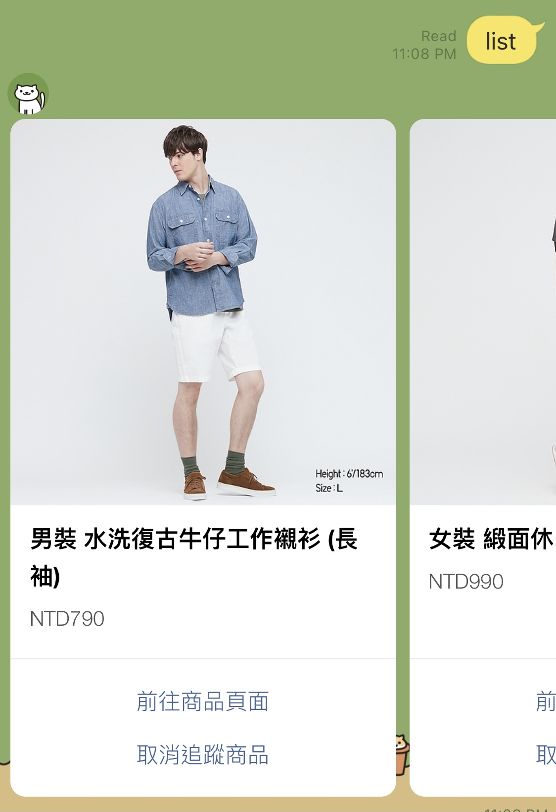

# UQ Price Down Notification Bot

Save the money!

> This service currently supports Taiwan UQ website only. If you would like to contribute to it, feel free to open clone the repo.

## Use cases

Users can use the LINE chatbot directly by entering commands or tapping the interactive pannels just after they adding the bot as a friend.

### Interaction

1. Add one UQ item to the tracking list.
2. Manage the personal tracking list.



### Notification

1. When the items tracked by the user is on-sale, the user will get a notification.


## Host the service

### Prerequisites

To host the service, you'll need to prepare the information listed below.

1. Retrieve LINE Official Account information from [LINE Developers](https://developers.line.biz/).
    1. Channel secret
    1. Channel token
    1. User ID
2. Azure Storage Account for blob storage.

### Run the application

1. Build the image.

    ```bash
    docker image build -t uq_notifier:latest .
    ```

2. Run the container.

    You can use environment variables to configure the app.

    ```bash
    docker container run --rm -d -p 80:80 \
        -e "LINE_LINE_BOT_USER_ID=<USER_ID>" \
        -e "LINE_LINE_BOT_CHANNEL_SECRET=<CHANNEL_TOKEN>" \
        -e "LINE_LINE_BOT_CHANNEL_TOKEN=<CHANNEL_TOKEN>" \
        -e "AZURE_ACCOUNT_NAME=<AZURE_STORAGE_ACCOUNT_NAME>" \
        -e "AZURE_ACCOUNT_KEY=<AZURE_STOAGE_ACCOUNT_KEY>" \
        -e "AZURE_WEB_APP_CALLBACK_URL=https://host.docker.internal:80/callback" \
        --name=uq_bot uq_notifier:latest
    ```

## Development

Check out the [docs](docs/development.md).

## Contribution

The visual elements and the arts are designed by [Pearl Chen](mailto:pearlchen317@gmail.com).

## Disclaimer

This project doesn't lead to any profitability.
