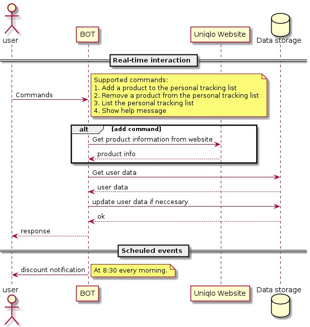
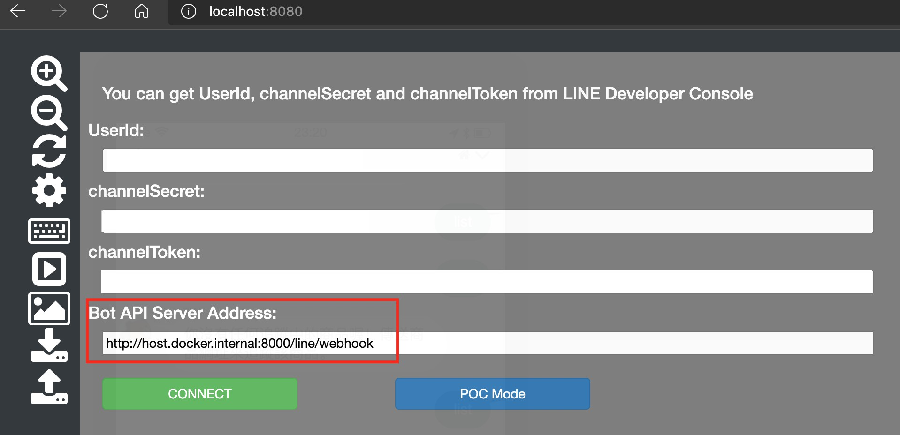

# UQ-price-notification

Save the money!

> This service currently supports Taiwan UQ website only. If you would like to contribute to it, feel free to open an issue.

## Use cases

Users can use the LINE chatbot directly by entering commands just after they adding the bot as a friend.
Currently the service provides following functionalities.

1. Follow a UQ product. If the product has discount in the future, the bot will notify the users who subscribe to the product.
1. Unfollow a product.
1. List following products.



## Development

### Requirements

1. Docker Desktop
1. Python 3.8
1. [LINE Official Account](https://account.line.biz/)
1. Azure blob storage service  
   We plan to support SQL service in future phase.

### Prerequisites

To run this app locally, you'll need to finish some stuff.

1. Use a [LINE simulator](https://github.com/kenakamu/LINESimulator) developed by kenakamu san.

    1. Clone the repository.
    1. Build the Docker image.

        ```bash
        docker image build --tag=linesimulator .
        ```

    1. Run the container on port `8080`.

        ```bash
        docker container run -d --rm -p 8080:8080 linesimulator
        ```

2. Retrieve LINE Official Account information from [LINE Developers](https://developers.line.biz/).
    1. Channel secret
    1. Channel token
    1. User ID

### Run the service

1. Build the image.

    ```bash
    docker image build -t uq_notifier:latest .
    ```

2. Run the container.

    You can use environment variables to configure the app.

    ```bash
    docker container run --rm -d -p 80:80 \
        -e "LINE_LINE_BOT_USER_ID=<USER_ID>" \
        -e "LINE_LINE_BOT_CHANNEL_SECRET=<CHANNEL_TOKEN>" \
        -e "LINE_LINE_BOT_CHANNEL_TOKEN=<CHANNEL_TOKEN>" \
        -e "AZURE_ACCOUNT_NAME=<AZURE_STORAGE_ACCOUNT_NAME>" \
        -e "AZURE_ACCOUNT_KEY=<AZURE_STOAGE_ACCOUNT_KEY>" \
        -e "AZURE_WEB_APP_CALLBACK_URL=https://host.docker.internal:80/callback" \
        --name=uq_bot uq_notifier:latest
    ```

### Test by LINE simulator

Once the LINE simulator and LINE bot service are running, you can test the service by using browser to visit [http://localhost:8080/](http://localhost:8080/). Fill the field with your LINE bot info, the **Bot API Server Address** is `http://host.docker.internal/line/webhook`.


## Deployment

To deploy FAST API app to Azure Web App, configure the service with the following settings

-   Startup command: `gunicorn -w 4 -k uvicorn.workers.UvicornWorker app.main:app`
